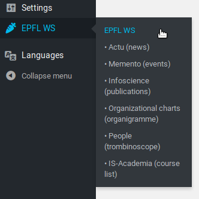

# EPFL Web Services Plugin
This Wordpress plugin aim to unify all EPFL web services in one place.

<!-- toc -->

- [EPFL Actu (news)](#epfl-actu-news)
  * [Actu custom post type and taxonomy](#actu-custom-post-type-and-taxonomy)
  * [Actu Shortcode](#actu-shortcode)
    + [Actu Shortcode Info](#actu-shortcode-info)
- [EPFL Memento (events)](#epfl-memento-events)
  * [Memento Shortcode Info](#memento-shortcode-info)
- [EPFL Infoscience](#epfl-infoscience)
- [IS-Academia](#is-academia)
- [EPFL Organizational Charts (organigramme)](#epfl-organizational-charts-organigramme)
- [EPFL People (trombinoscope)](#epfl-people-trombinoscope)

<!-- tocstop -->

# About

# EPFL Actu (news)

The Actu part of this plugin is separeted in two parts, one is the shortcode and
the second is the Actu custom post.

## Actu custom post type and taxonomy

For each entry in actus.epfl.ch that the WordPress administrators
are interested in, there is a local copy as a post inside the
WordPress database. This allows e.g. putting actus news into the
newsletter or using the full-text search on them.

The "Actu" custom post type integrates with WP Subtitles, if
installed (https://wordpress.org/plugins/wp-subtitle/). Note that
only Actu items fetched *after* WP Subtitles is installed, can get
a subtitle.

## Actu Shortcode

Actu Shortcode allows you to integrate EPFL News (actus) in any Wordpress pages
or posts. To do so, just use the `[actu]` shortcode where ever you want to
display the news.

In addition, you can be very picky on which news you want, by passing some
arguments to the shortcode. Here are some example:

* `[actu]`
* `[actu tmpl=full channel=10 lang=en limit=3]`
* `[actu tmpl=short channel=10 lang=en limit=20 category=1 title=EPFL subtitle=EPFL text=EPFL faculties=6 themes=1 publics=6]`

Note that you don't have to specify any of these if you don't want to filter on
something.

### Actu Shortcode Info

* ShortCode **`[actu]`** available from page, post or text widget;
* Actu shortcode can takes arguments:
  * `tmpl`: the template you want to use
    * `full`: all information;
    * `short`: compact;
    * `widget`: title and first image only.
  * `channel`: the channel's ID (e.g. sti=10). You can search your channel's ID
    here: <https://actu.epfl.ch/api/v1/channels/?name=sti>;
  * `lang`: english (en) or french (fr);
  * `limit`: the number of news you want;
  * `category` is in [1: EPFL, 2: EDUCATION, 3: RESEARCH, 4: INNOVATION, 5: CAMPUS LIFE];
  * `publics` is in [1: Prospective Students, 2: Students, 3: Collaborators,
    4: Industries/partners, 5: Public, 6: Media];
  * `themes` is in [1: Basic Sciences, 2: Health, 3: Computer Science,
    4: Engineering, 5: Environment, 6: Buildings, 7: Culture, 8: Economy, 9: Energy];
  * `faculties` is in [1: CDH, 2: CDM, 3: ENAC, 4: IC, 5: SB, 6: STI, 7: SV];
  * `search`, `title`, `subtitle`, `text` are search arguments you can use to
     get news across the school on, in example, keywords.

# EPFL Memento (events)

💡 **Please be aware** that this shortcode still relate on the old
<https://wiki.epfl.ch/api-rest-actu-memento/memento>API and will switch to the
<https://memento.epfl.ch/api/v1/events/>new one whenever it's ready. 💡

Memento Shortcode allows you to integrate EPFL Events (memento) in any Wordpress
pages or posts To do so, just use the `[memento]` shortcode where ever you want
to display the news In addition, you can be very picky on which news you want,
by passing some arguments to the shortcode.

Here are some example:
* `[memento]`
* `[memento tmpl=full channel=STI lang=en limit=3]`
* `[memento tmpl=short channel=STI lang=en limit=20]`

## Memento Shortcode Info

* ShortCode **`[memento]`** available from page, post or text widget;
* Actu shortcode can takes arguments:
  * `tmpl`: the template you want to use
    * `full`: all information;
    * `short`: compact;
    * `widget`: title and first image only.
  * `channel`: the channel's name (e.g. `sti`).
  * `lang`: english (en) or french (fr);
  * `limit`: the number of news you want;

# EPFL Infoscience

Infoscience Shortcode allows you to integrate any infoscience exports on a
Wordpress page or post.

1. First head to <https://infoscience.epfl.ch/>;
1. Run a search with wanted parameters (e.g. `unit:sti`);
1. Click on the link `Integrate these publications into my website`;
1. Select wanted parameter (as grouped by year, detailed format, etc.);
1. When ready, save your export and copy the link (similar to `https://infoscience.epfl.ch/curator/export/12913/?ln=en`);
1. Use the shortcode with the url parameter: `[infoscience url=https://infoscience.epfl.ch/curator/export/12913/?ln=en]`.

<https://github.com/epfl-idevelop/jahia2wp/blob/43105bfb5819eda6f7ceccfd25ed0006c64db664/data/wp/wp-content/mu-plugins/EPFL-SC-infoscience.php>

# IS-Academia

[IS-Academia](https://is-academia.epfl.ch) is the management tools for studies at EPFL. This shortcode allows you to integrate EPFL automatic course list (IS-Academia) in any Wordpress pages or posts.
To do so, just use the `[isacademia unit=sgm-ens lang=en]` shortcode where ever you want to display it.
<https://jahia.epfl.ch/external-content/course-plan>

In addition, you can pass some arguments to the shortcode.

Here are some example:
* per laboratory: `unit=XXX,XXX` >the acronym of the laboratory(s)
* per section: `unit=XXX-ens`
* per teacher: `scipers=123456,123457`
* per semester: `sem=ete` or `sem=hiver`
* per cursus: `cursus=ba` (bachelor's), `cursus=ma` (master's), `cursus=phd` (phd)
* sorting: `display=byprof`
* selecting the detail level:
    * `detail=S` > name of course with link + teachers
    * `detail=M` > the same + description and language
    * `detail=L` > the same + curriculum + academic year

This page <https://jahia.epfl.ch/external-content/automatic-course-list#faq-488738> summarize the options.

# EPFL Organizational Charts (organigramme)
* <https://jahia.epfl.ch/contenu-externe/organigramme>

# EPFL People (trombinoscope)

People Shortcode allows you to integrate EPFL People (trombinoscope) in any
Wordpress pages or posts. To do so, just use the `[people unit=sti-it lang=fr]`
shortcode where ever you want to display the news. In addition, you can be very
picky on which news you want, by passing some arguments to the shortcode.

Here are some example:
* `[people tmpl=default_aZ_pic_side lang=en unit=STI-IT]`
* `[people tmpl=default_aZ_pic_side lang=en unit=STI subtree=1 struct=1 function=prof nophone=0 nooffice=0 responsive=0]`

If you need more specific tuning, you can use [people url=XXX], with composing a valid URL from <https://jahia.epfl.ch/contenu-externe/liste-de-personnes/composer>:
* `[people url=https://people.epfl.ch/cgi-bin/getProfiles?lang=en&unit=STI&subtree=1&nophone=1&function=professeur+ordinaire]`
